---
date:
  created: 2026-06-06
categories:
  - "الكتاب المقدس"
  - "دراسات" 
tags:
  - "الكتاب المقدس" 
---

# بالخرائط والتواريخ.. الرحلة الكاملة لشعب الله في العهد القديم

كتير مننا لما بيفتح العهد القديم بيحس إنه تاه في وسط الأسماء الجغرافية الكتيرة، والتواريخ المتباعدة، والأنبياء اللي ميعرفش مين جه قبل مين ولا مين كلم مين. الجغرافيا في الكتاب المقدس مش مجرد "خلفية صامتة"، دي المسرح الحي اللي دارت عليه قصة حب الله الكبرى للبشرية، قصة الخلاص اللي بدأت من جنة عدن ووصلت لحد تجسد المسيح في بيت لحم.

عشان كدة، في المقال ده، مش بس هنقرا كلام.. إحنا هنمشي مع "الخريطة" خطوة بخطوة، وهنشوف إزاي الجغرافيا والتاريخ بيشهدوا بدقة مذهلة عن يد الله اللي بتوجه الأحداث، من العراق لمصر لكنعان، ومن السبي للرجوع. جهز رحلتك وتعال نفهم العهد القديم بطريقة جديدة ومبسطة جداً!

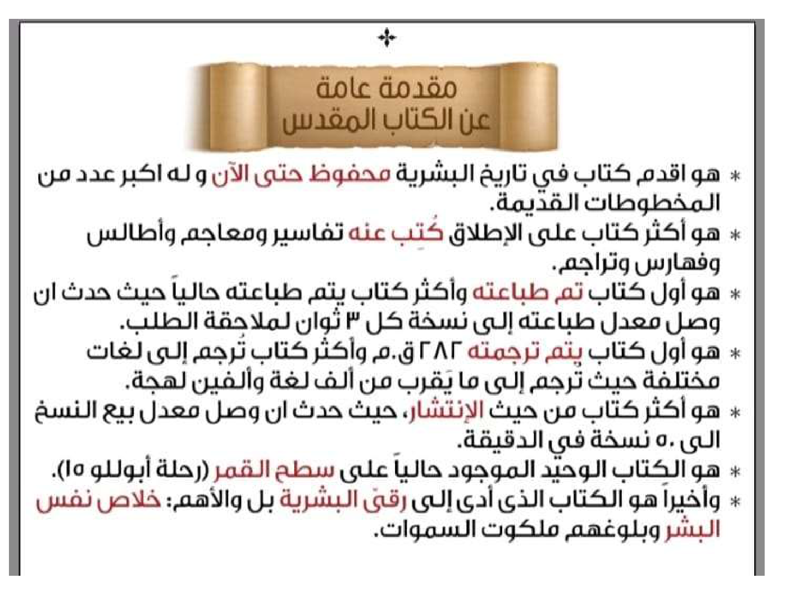

<!-- more -->

---

## 1. عظمة وبقاء الكتاب: حقائق مدهشة تسبق التاريخ

قبل ما ندخل في تفاصيل الجغرافيا، لازم نسأل نفسنا: إيه سر قوة الكتاب ده؟ الأرقام والحقائق التاريخية بتقولنا إننا مش قدام كتاب عادي خالص، بل هو "ظاهرة فريدة" عبر العصور:

* **الأقدم والأوثق:** هو أقدم كتاب في تاريخ البشرية فضل محفوظ لحد النهاردة، وبيمتلك أكبر عدد من المخطوطات القديمة اللي بتثبت صحته ودقته.
* **البطل المطبوع:** هو أول كتاب في التاريخ يتم طباعته بآلة جوتنبرج، والنهاردة هو الأكثر طباعة وتوزيعاً بلا منازع (وصل معدل طباعته في بعض الفترات لنسخة كل 3 ثواني، ومعدل بيعه لـ 50 نسخة في الدقيقة!).
* **العابر للغات:** أول كتاب يُترجم في التاريخ (الترجمة السبعينية سنة 282 ق.م)، وهو الأكثر ترجمة على الإطلاق، حيث تُرجم لـ ما يقرب من 1000 لغة و2000 لهجة.
* **الكتاب الفضائي:** هو الكتاب الوحيد الموجود حالياً على سطح القمر، بعد ما أخده رواد فضاء رحلة "أبولو 15" معاهم.
* **المكتبة الأكثر دراسة:** هو أكتر كتاب اتكتبت عنه تفاسير، وقواميس، وفهارس، وأطالس جغرافية لتتبع خطاه.

---

## 2. بنية العهدين: التوازي المدهش بين القديم والجديد

من الأسرار الجميلة في الكتاب المقدس هي "الهندسة المتوازية" في تقسيمة الأسفار بين العهدين. التقسيم مش عشوائي، بل بيمشي في خطوط متوازية بتوريك إن العهد الجديد هو إكمال وتحقيق للعهد القديم:

| التقسيم الروحي للأسفار | العهد القديم (46 سفراً) | العهد الجديد (27 سفراً) |
| :--- | :--- | :--- |
| **أسفار الشريعة / التأسيس** | **التوراة (أسفار موسى الـ 5):** أساس العلاقة والشريعة. | **الأناجيل الـ 4:** أساس العهد الجديد وحياة المسيح. |
| **أسفار التاريخ / الحركة** | **الأسفار التاريخية (12 سفراً):** رحلة الشعب وأحداث المملكة. | **أعمال الرسل (سفر واحد):** رحلة الكنيسة وانتشار البشارة. |
| **أسفار الحكمة / المشاعر** | **الأسفار الشعرية والحكمية (5 أسفار):** مناجاة القلب وحكمة الحياة. | **الرسائل (21 رسالة):** التعليم الروحي والتطبيق العملي. |
| **أسفار النبوة / الرجاء المستقبلي** | **الأسفار النبوية (17 سفراً):** رؤية المستقبل والوعد بالخلاص. | **سفر الرؤيا (سفر واحد):** كشف المجد الأبدي والنهاية السعيدة. |

> [!NOTE] 📚 مكتبة واحدة من 73 سفراً
> الكتاب المقدس بيحتوي على **73 سفراً** (46 عهد قديم + 27 عهد جديد). شارك في كتابته حوالي **40 كاتباً** على مدار **1600 سنة**! ورغم التباين الرهيب ده بين الكتّاب (من ملوك زي داود وصيادين زي بطرس لفلاسفة زي بولس ورعاة غنم زي عاموس)، تخرج لنا سيمفونية واحدة بنكهة واحدة، وهدف واحد، ورموز متكاملة مستحيل تكون صدفة بشرية.

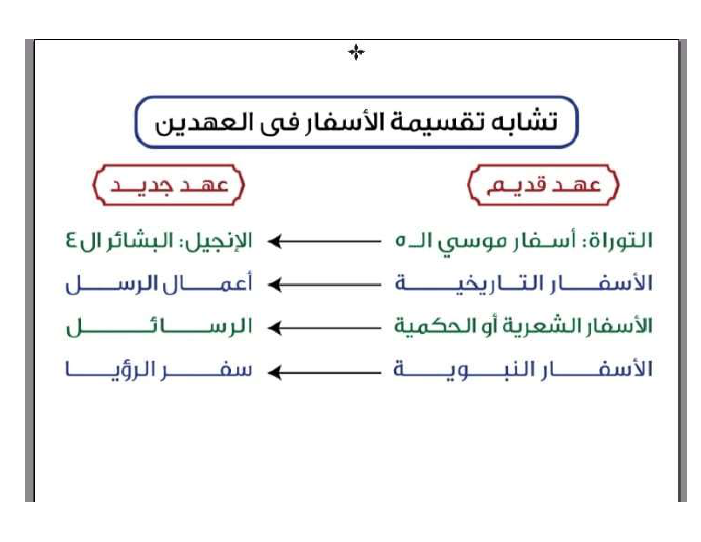

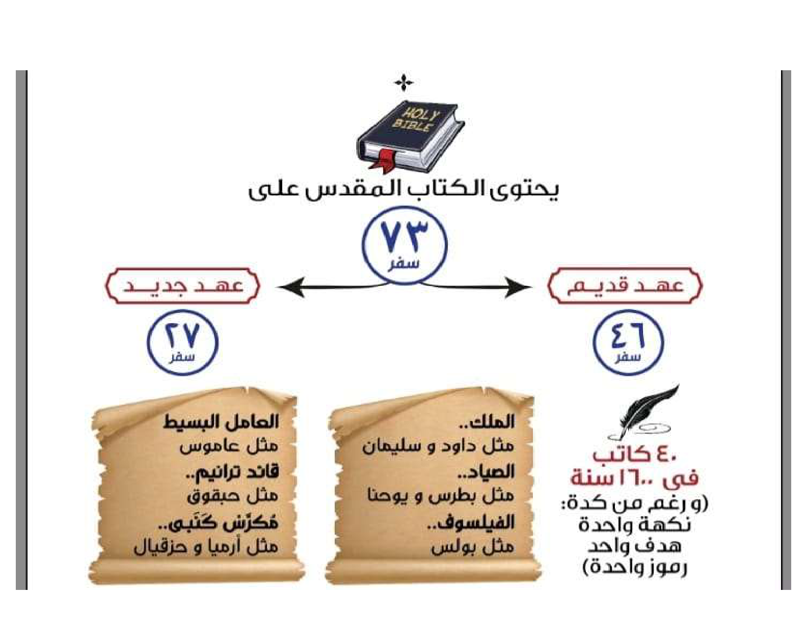

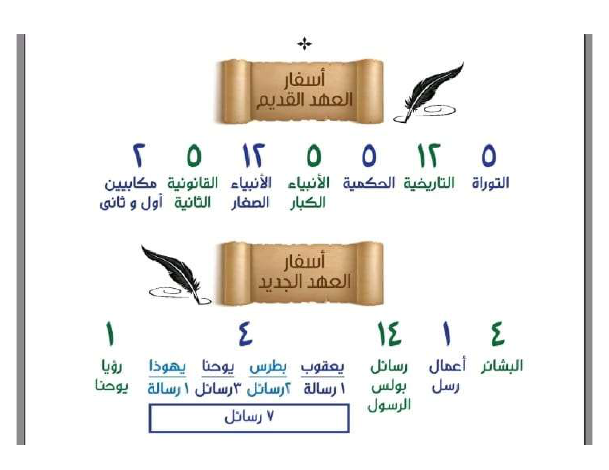

---

## 3. جغرافيا الخلاص: المثلث الذهبي للأحداث

العهد القديم كله بيدور عملياً جوه "مثلث جغرافي" رئيسي بيربط بين 3 بلاد أساسية:

1. **العراق (أرض النهرين - دجلة والفرات):** نقطة البداية (منشأ إبراهيم أبو الآباء)، والمسرح الأخير لقصة السبي (آشور وبابل ومادي وفارس).
2. **كنعان (أرض الموعد):** المسرح الرئيسي لأحداث العهد القديم، الأرض اللي وعد بيها ربنا إبراهيم ونسله، وفيها اتأسست المملكة وهيكل سليمان.
3. **مصر (أرض النيل):** الملاذ الآمن وقت المجاعات (قصة يوسف)، ومكان العبودية الصعبة، ومنطلق معجزة الخروج الكبرى بقيادة موسى.

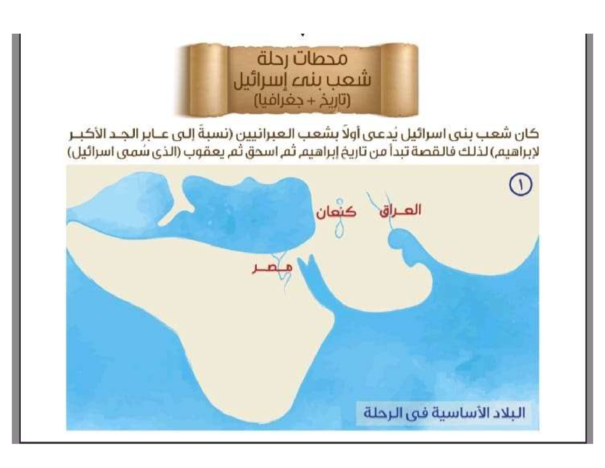

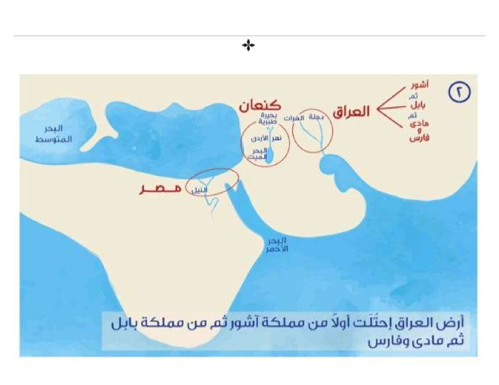

---

## 4. المحطات الجغرافية الكبرى لشعب الله

لو عايزين نلخص رحلة العهد القديم جغرافياً وتاريخياً، هنلاقيها بتتحرك في محطات متتالية وواضحة:

### المحطة الأولى: الآباء والرحلة الأولى (حوالي 2000 ق.م)
* **رحلة إبراهيم:** يخرج إبراهيم بأمر إلهي من أرض العراق (أور الكلدانيين) متجهاً إلى كنعان ليتلقى الوعد الإلهي: "لنسلك أعطي هذه الأرض".
* **رحلة يوسف:** يخرج يوسف كعبد مقيد من كنعان إلى مصر بسبب غيرة إخوته، ليتحول هناك إلى منقذ للعالم من المجاعة، وتنتقل عائلته كلها (يعقوب وبنيه) لتعيش في مصر.

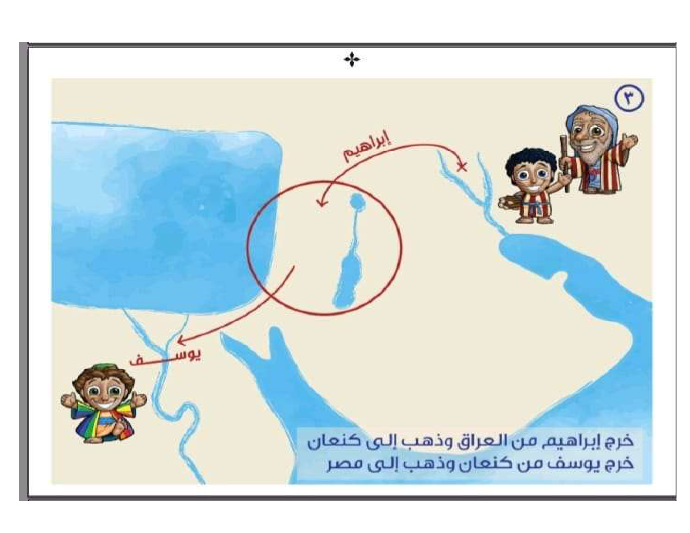

### المحطة الثانية: الخروج والدخول (حوالي 1500 ق.م)
* **موسى والخروج:** يرسل الله موسى النبي ليخرج الشعب من عبودية مصر، ليدوروا في رحلة التيه في البرية لـ 40 سنة يتلقوا خلالها الشريعة والوصايا العشر (أسفار التوراة الـ 5).
* **يشوع والدخول:** يقف موسى على حدود أرض الموعد ويسلم القيادة لـ "يشوع بن نون"، وهو البطل اللي بيعبر بالشعب نهر الأردن ويدخلهم كنعان ويبدأ بتقسيم الأرض على أسباط إسرائيل الـ 12.

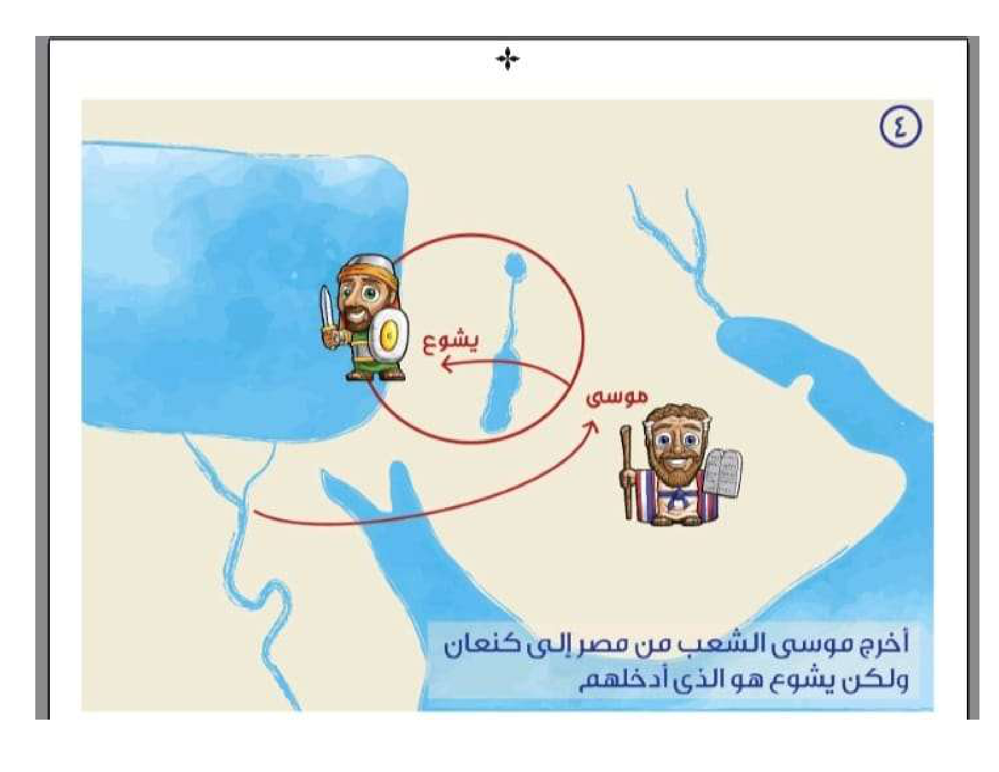

### المحطة الثالثة: عصر القضاة والمملكة الموحدة
* **عصر القضاة:** بعد موت يشوع، يدخل الشعب في فترة اضطراب دامت قرون، يحكمهم فيها **12 قاضياً** (آخرهم صموئيل النبي). في الفترة دي كانوا دايماً محاطين بأعداء طامعين في أرضهم (الآراميين، الفلسطينيين، العماليق، المديانيين، العمونيين، المؤابيين، والأدوميين).

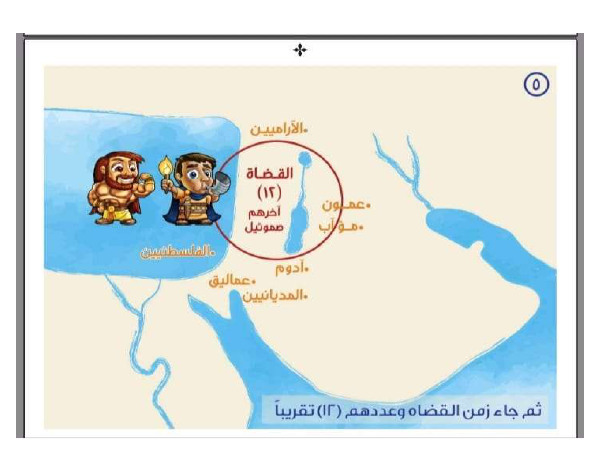

* **المملكة الموحدة:** يطلب الشعب ملكاً، فتبدأ المملكة الموحدة بقيادة **شاول**، ثم الملك البار **داود** اللي بيأسس أورشليم كعاصمة، ثم ابنه **سليمان** اللي بيبني الهيكل العظيم في قمة مجد المملكة واستقرارها الجغرافي.

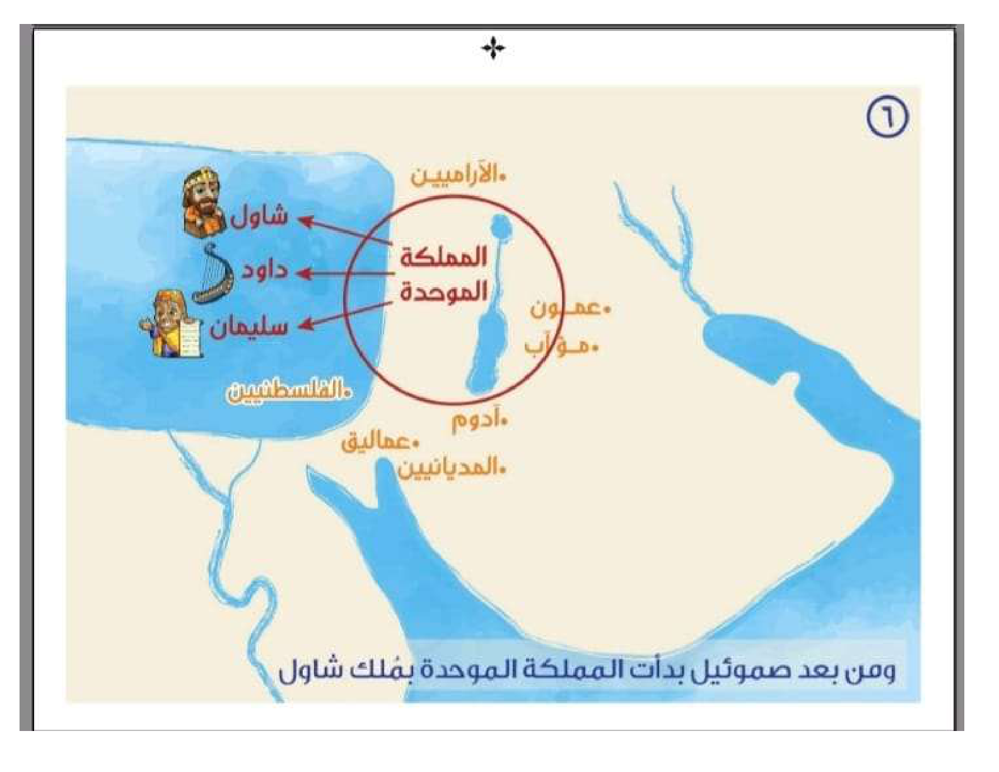

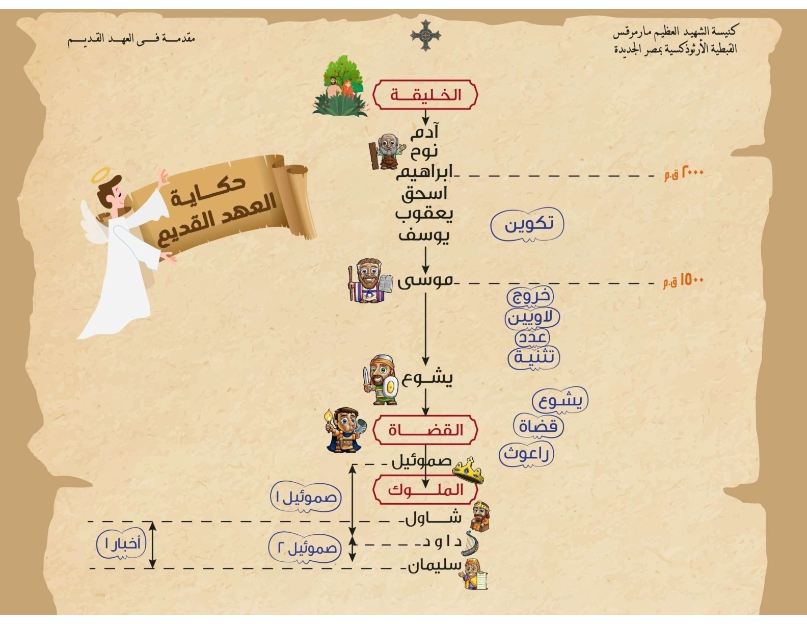

---

## 5. الانقسام المأساوي: مملكتان ومصيران

بعد موت سليمان، تسببت كبرياء ابنه "رحبعام" في انقسام المملكة جغرافياً وروحياً (حوالي 930 ق.م):

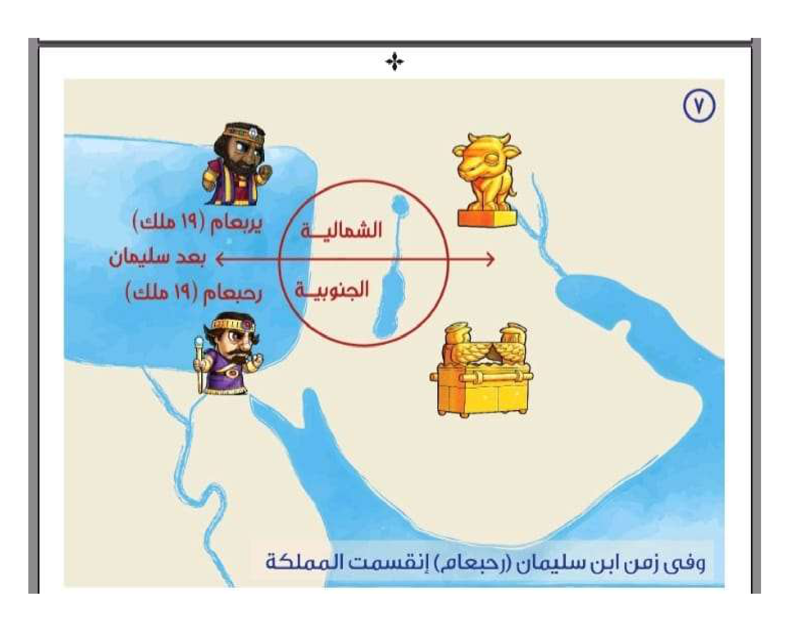

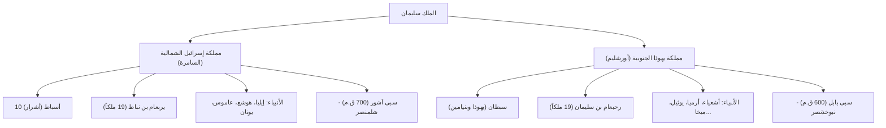
```mermaid
graph TD
    A["الملك سليمان"] --> B["مملكة إسرائيل الشمالية (السامرة)"]
    A --> C["مملكة يهوذا الجنوبية (أورشليم)"]
    
    B --> B1["10 أسباط (أشرار)"]
    B --> B2["يربعام بن نباط (19 ملكاً)"]
    B --> B3["الأنبياء: إيليا، هوشع، عاموس، يونان"]
    B --> B4["سبى آشور (700 ق.م) - شلمنصر"]
    
    C --> C1["سبطان (يهوذا وبنيامين)"]
    C --> C2["رحبعام بن سليمان (19 ملكاً)"]
    C --> C3["الأنبياء: أشعياء، أرميا، يوئيل، ميخا..."]
    C --> C4["سبى بابل (600 ق.م) - نبوخذنصر"]
```

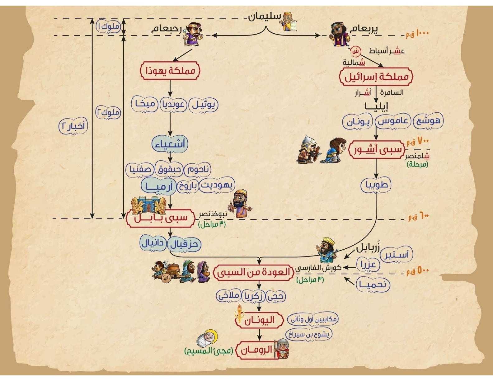

### أولاً: المملكة الشمالية (إسرائيل / السامرة)
* **حجمها:** ضمت 10 أسباط.
* **قادتها:** حكمها 19 ملكاً، والأسفار بتصفهم كلهم بالأشرار لأنهم أسسوا عبادة الأوثان (عجول الذهب) للابتعاد عن أورشليم.
* **أنبيائها:** أرسل الله لهم أنبياء عظام لتحذيرهم مثل إيليا الناري، هوشع، عاموس، ويونان.
* **نهايتها (سبى آشور - 700 ق.م):** بسبب إصرارهم على الشر، سمح الله بسقوطهم في يد الإمبراطورية الآشورية بقيادة "شلمنصر"، وتشتت الأسباط العشرة (وخلال هذه الفترة الصعبة بتظهر قصة طوبيا البار في السبي).

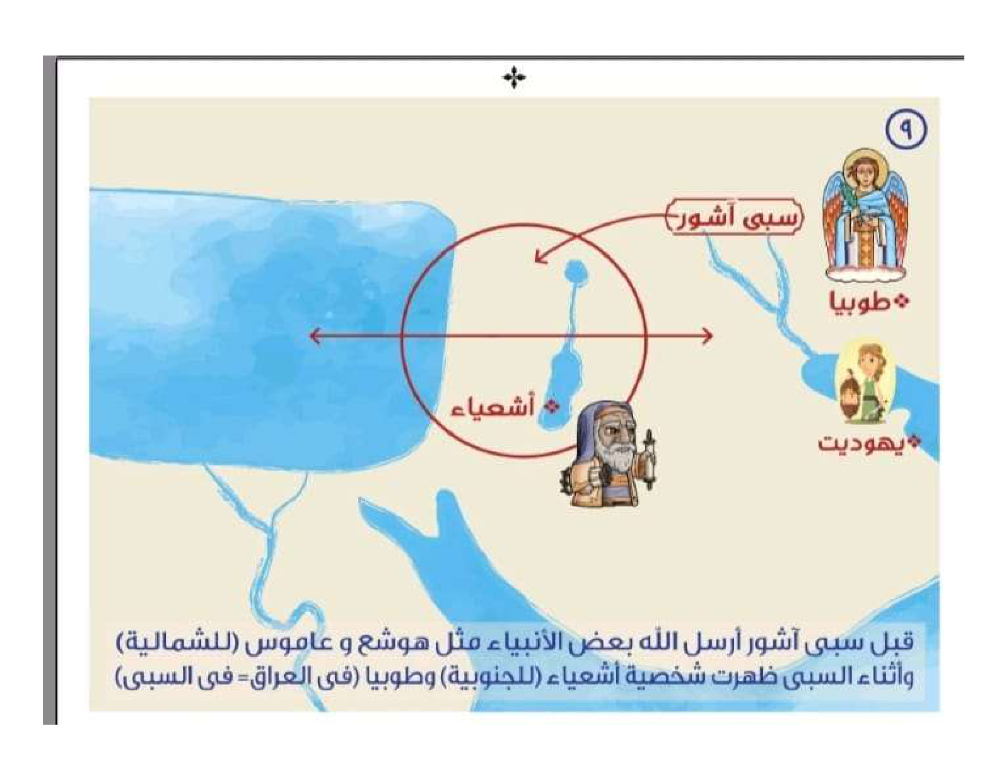

### ثانياً: المملكة الجنوبية (يهوذا)
* **حجمها:** ضمت سبطين فقط (يهوذا وبنيامين) ومعاهم مدينة أورشليم والهيكل.
* **قادتها:** حكمها 19 ملكاً (من نسل داود)، كان فيهم الصالح (مثل حزقيا ويوشيا) وفيهم الشرير.
* **أنبيائها:** تنبأ فيها عدد كبير من الأنبياء مثل أشعياء (الذي عاصر سبى آشور)، أرميا الباكي (الذي عاصر السقوط)، يوئيل، ميخا، صفنيا، وحبقوق.
* **نهايتها (سبى بابل - 600 ق.م):** بعد ما تهاونت المملكة ورفضت تحذيرات أرميا، سقطت في يد الإمبراطورية البابلية بقيادة "نبوخذ نصر" على **3 مراحل**، وتم تدمير أورشليم وحرق الهيكل، واقتيد الشعب أسرى لبابل.

---

## 6. السبي والعودة: من بابل إلى مجيء المسيح

السبي مكنش نهاية القصة، بل كان مدرسة لتأديب الشعب وإعدادهم للمستقبل:

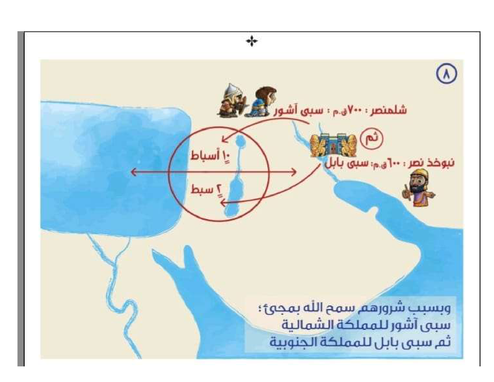

* **أنبياء السبي في العراق:** في قلب الغربة وفي أرض بابل، أقام الله أنبياء عظام ليعطوا الشعب رجاءً مثل **دانيال** (في قصر ملوك بابل وفارس) و**حزقيال** (بجوار نهر خابور).

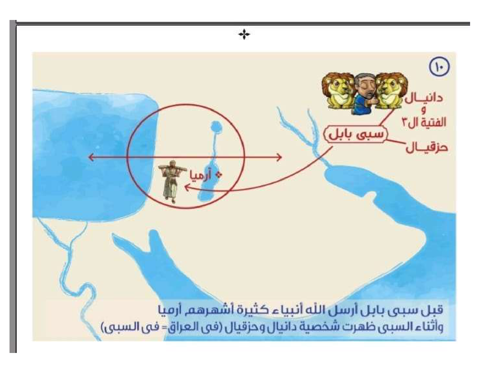

* **العودة زمن فارس (حوالي 500 ق.م):** بعد 70 سنة من السبي، يسقط البابليون في يد إمبراطورية مادي وفارس. ويصدر الملك "كورش الفارسي" أمراً بعودة اليهود لبناء هيكلهم.
* **العودة على 3 أفواج:**
  1. **الفوج الأول بقيادة زربابل:** لإعادة بناء الهيكل المهدوم.
  2. **الفوج الثاني بقيادة عزرا الكاهن:** لترميم الشريعة والحياة الروحية والتعليم.
  3. **الفوج الثالث بقيادة نحميا:** لإعادة بناء أسوار أورشليم المهدمة.

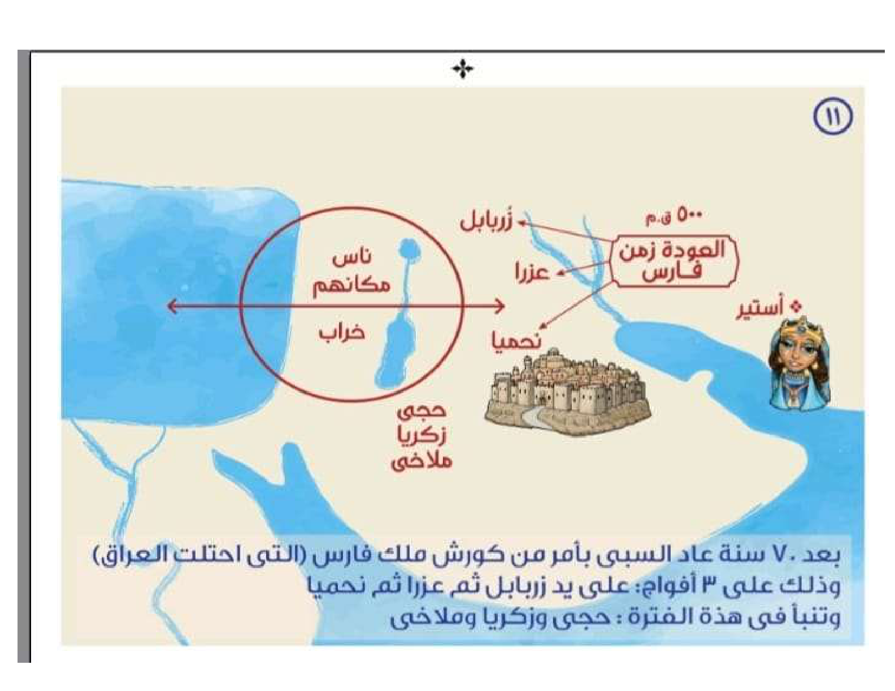

* **أنبياء العودة:** عاصر هذه العودة الأنبياء **حجي** و**زكريا** و**ملاخي** (آخر أنبياء العهد القديم) اللي شجعوا الشعب على البناء وبشروهم بمجد الهيكل الثاني ومجيء المخلص.

---

## الخلاصة: خريطة تقودنا للمسيح

بعد انتهاء حقبة الأنبياء والعودة، مر الشعب بفترة حكم اليونانيين (وظهور ثورة المكابيين وكتابة أسفار المكابيين ويشوع بن سيراخ)، ثم سقطت الأرض تحت حكم الرومان.

في هذه اللحظة بالذات، لما "جاء ملء الزمان"، تجسد السيد المسيح في الجغرافيا المحددة اللي اترسمت معالمها على مدار 2000 سنة!

الخرائط دي مش مجرد خطوط جغرافية قديمة، دي بتحكي قصة حياتي وحياتك:
1. **الخروج من مصر:** هو خروجك من عبودية الخطيئة.
2. **التيه في البرية:** هو جهادك الروحي اليومي.
3. **أرض كنعان:** هي السلام الداخلي والملكوت اللي بنسعى ليه.

ربنا اللي قاد إبراهيم وموسى وداود ووجه التاريخ الإنساني كله بممالكه الكبرى (آشور وبابل وفارس واليونان والرومان) عشان يتمم خطة خلاصه، هو هو اللي بيقود سفينة حياتك النهاردة.. فهل إنت مستعد تسلم له خريطتك؟
